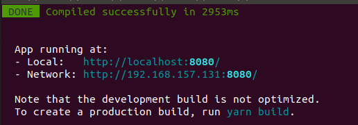

# xiaowei

本项目为小猬智能车网站

## 环境配置（ubuntu）

安装node

```shell
sudo apt-get install nodejs
sudo apt-get install npm
```

npm换源

```shell
# 更换为淘宝镜像
npm config set registry https://registry.npm.taobao.org
# 验证是否修改成功
npm config get registry
```

检查node版本

```shell
node --version
```

为防止不必要的错误，尽量使用 `v14.8.0` 版本，如果版本较低，可使用npm提供的工具`n`进行升级

```shell
sudo npm install -g n
sudo n 14.8.0
# 再次检查node版本
node --version
```

安装`yarn`包管理工具

```shell
sudo npm install -g yarn
# 检查是否安装成功
yarn --version
```

同样给`yarn`换源

```shell
# 更换为淘宝镜像
yarn config set registry https://registry.npm.taobao.org
# 验证是否修改成功
yarn config get registry
```

进入项目目录下安装项目环境依赖

```shell
cd xiaowei
# 安装依赖包
yarn install
```

至此，项目所需环境安装完毕，后续开发无需再次进行上述操作。

## 开发流程

启动预览服务器

```shell
yarn serve
```



不出意外的话结果会和上图类似，预览服务器就启动成功了，可以在浏览器中使用上述的地址进行访问。

这个预览服务器可以在开发时一直启动，在修改了页面后会自动刷新，修改后的结果能够及时在浏览器中看到。

## 项目目录结构

```shell
 .
├── assets				# README需要的图片
    ├──...
├── public				# vue项目的外部目录
    ├── favicon.ico
    └── index.html
├── node_modules				# node依赖包
    ├── ...
└── src
    ├── App.vue					# vue项目的根文件
    ├── assets				# 项目需要的资源文件
    ├── components				# 自定义的各种组件，可以在这里定义组件
    ├── main.js				# vue项目的根脚本
    ├── plugins				# 外部引入的插件
    ├── router				# vue router定义的文件
    └── views				# 主要页面视图

```


## 学习资料

+ 基本的html知识，如标签、属性等，可以在[w3school](https://www.w3school.com.cn/html/index.asp)中学习

+ 对于vue框架本身，请参考[vue官方文档](https://cn.vuejs.org/v2/guide/)

+ 对于一些比较方便实用的组件，如按钮、表格等，可以到[element-ui](https://element.eleme.cn/2.14/#/zh-CN/component/installation)上找到样例